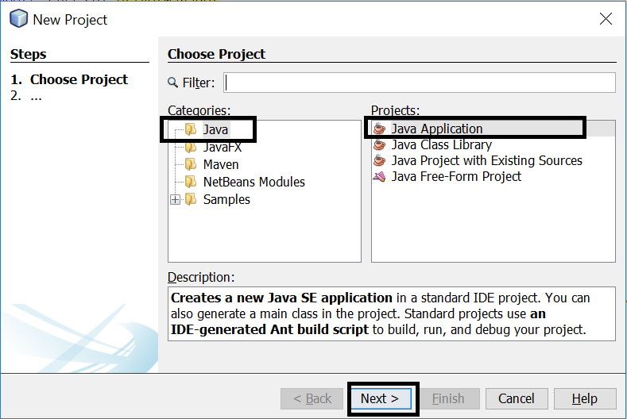
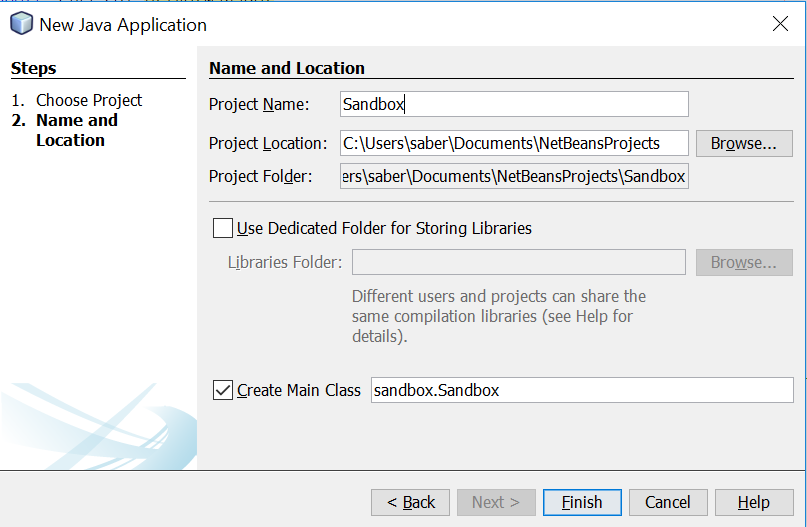
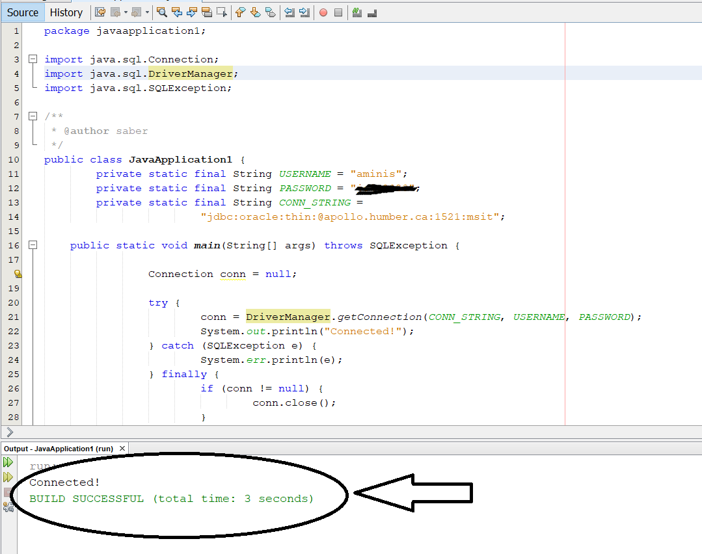

# Background

The Java portion of the course involves using a Java program to make the queries and updates that we have done using SQL.  The first question that arises then is why would we want to do such a thing? 

If you remember from our discussion on relational databases, there are three components to a database management system (DBMS).  This is the Database Application, the Database Engine and the actual Database.  

We have worked on the concept of  building Databse schemas and working with them using CRUD.

You can argue that we have used some kind of graphical user interface by using SQL Devloper, but this required us to know SQL and execute increasing complex queries.  We likely need a more user friendly GUI (with bottons, menue items etc) if our database will be used by someone that does not have knowledge of SQL.

To do this, we use Java to build an application.  But in order for this application to talk to our database we need certain functions.  These functions or subroutines are collectively call the API.  

Now you do not have to be an expert, but you can think abstracty that our Java program that we build must somehow "connect" to our database.  We then need ways to write queries that will be converted to SQL queries.  So there are a lot of details that need to be taken care of, but fortunately, we do not care much about these details.  We simply abstract things.

The API we use to interact with our database is called JDBC - Java Database Connectivity.  However, apart from the API, we also need a JDBC driver.  The details of this setup are <a href="http://www.tutorialspoint.com/jdbc/jdbc-driver-types.htm" target="_blank">explained in more detail here</a>.

Again, for our purposes, these details are not important.  You can think of the JDBC API as the methods or function declarations.  The JDBC driver is then the specific implementation or definition of these functions and these are specific to the vendor (as are specifc SQL commands).  How this API-Driver interaction occurs is a matter of detail and there are four different driver types which have historically progressed as new methods have taken over the old.  It is generally agreed that if you are buidling a GUI from scratch, you should use a <b>Type 4</b> driver unless there is a very good specific reason you do not want to do this.

# A Skeleton Java Project for Running Queries

We want to start by creating a skeleton Java project to connect to our SQL Server database and make queries.  We are roughly following the instructions in Chapter 2 of <a href="https://www.lynda.com/Java-tutorials/What-JDBC/110284/117302-4.html" target="_blank">Java: Database Integration with JDBC</a> 

Please watch the video, it is a good introdcution to JDBC API and drivers.  The setup uses MySQL and Eclipse rather than PL/SQL and Netbeans, but the instructions can easily be adapted.  Follow the instructions below to setup a skeleton for running queries through Java.

The Lynda.com video tutorial uses <i>Eclipse</i> but we will use <i>Netbeans</i>.  What is the difference between Netbeans and Eclipse and which one should you use?  There is in fact no hard answer (although some prefers would disagrea).  You may find <a href="https://stackoverflow.com/questions/330027/what-is-the-difference-between-eclipse-and-netbeans-if-i-want-to-use-only-the-ja" target="_blank"> this discussion on Stackoverflow where users give their opinion interesting</a>.

Anyways, let's get started.  First, we want to download Netbeans (if you have not done so already) from https://netbeans.org/downloads/index.html.  Computer labs in school already have Netbeans installed, so if you do not want to download the softwware on your personal computer/laptop, just use a school computer and skip to the instructions on project setup.

I suggest choosing Java EE as shown below:

If the installer cannot find a compatible JDK installation on your system, you should Cancel the installation and install the following instead http://www.oracle.com/technetwork/java/javase/downloads/jdk-netbeans-jsp-142931.html

# Setting up the Java Project
To test your installation, Open up Netbean and then from the menu bar choose File->New Project->Java->Java Application->Next as shown below:

Choose a project name and directory (doesn't really matter where):

Click finish.

Add: System.out.println("Hello World!"); to your main function and choose Run.  You should see a successful Build (and Hello World! in the output window).

Download ojdbc6.jar from blackboard (under Lectures, Lecture 8) and follow the video tutorial on setting up the rest of the environment (it is a good idea to just watch the video once, then go over it again while setting up the environment).  Remember the video uses MySQL and HyperSQL, our connection string will be ("jdbc:oracle:thin:@apollo.humber.ca:1521:msit").

Your final project should look something like this and when you run it you should get a confirmation that you connected.

