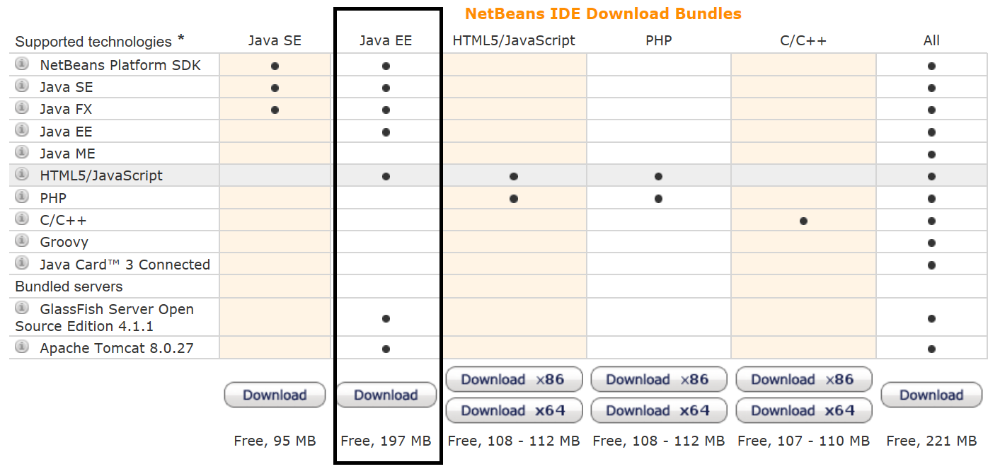

# Background

The Java portion of the course involves using a Java program to make the queries and updates that we have done using SQL.  The first question that arises then is why would we want to do such a thing? 

If you remember from our discussion on relational databases, there are three components to a database management system (DBMS).  This is the Database Application, the Database Engine and the actual Database.  

We have worked on the concpet ob uilding Databse schemas and working with them using CRUD.

You can argue that we have used some kind of graphical user interface by using SQL Devloper, but this required us to know SQL and excute increasing complex queries.  We likely need a more user friendly GUI (with bottons, menue items etc) if our database will be used by someone that does not have knowledge of SQL.

To do this, we use Java to build an application.  But in order for this application to talk to our database we need certain functions.  These functions or subroutines are collectively call the API.  

Now you do not have to be an expert, but you can think abstracty that our Java program that we build must somehow "connect" to our database.  We then need ways to write queries that will be converted to SQL queries.  So there are a lot of details that need to be taken care of, but fortunately, we do not care much abou these details.  We simply abstract things.

The API we use to interact with our database is called JDBC - Java Database Connectivity.  However, apart from the API, we also need a JDBC driver.  The details of this setup are <a href="http://www.tutorialspoint.com/jdbc/jdbc-driver-types.htm">explained in more detail here</a>.

Again, for our purposes, these details are not important.  You can think of the JDBC API as the methods or function declarations.  The JDBC driver is then the specific implementation or definition of these functions and these are specific to the vendor (as are specifc SQL commands).  How this API-Driver interaction occurs is a matter of detail and there are four different driver types which have historically progressed as new methods have taken over the old.  It is generally agreed that if you are buidling a GUI from scratch, you should use a <b>Type 4</b> unless there is a very good specific reason you do not want to do this.

# A Skeleton Java Project for Running Queries

We want to start by creating a skeleton Java project to connect to our SQL Server database and make queries.  First of all, try to download Netbeans if you already have not done so from https://netbeans.org/downloads/index.html.  I suggest choosing Java EE as shown below:

If the installer cannot find a compatible JDK installation you probably want to Cancel the installation and install the following instead http://www.oracle.com/technetwork/java/javase/downloads/jdk-netbeans-jsp-142931.html
To test your installation Choose File->New Project->Java->Java Application->Next->Finish.
Add: System.out.println("Hello, World"); in to your main and choose Run.
Download ojdbc6.jar and right-click on "Libraries" in your project navigator pane to add the JAR to your project. Using "import java.sql.*;" in your code will allow use of this.
The examples use MySQL and HyperSQL, to build our connection string ("jdbc:oracle:thin:@apollo.humber.ca:1521:msit") explore right-clicking "Databases" in the project services pane to add the connection in a similar way to how it is in SQL Developer.
